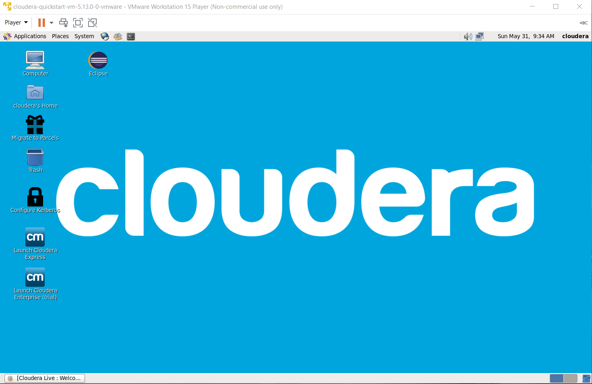

# Hive exercise

## Introduction
This exercise was completed in preparation for the Big Data course at [University of Zanjan](https://www.znu.ac.ir/en) in 2021.

To perform this exercise and the following exercises, the cloudera-quickstart-vm-5.13.0-0-vmware file, which is actually the cloudera virtual machine, was downloaded and to be able to use it, the VMWare Player 15.5 software was also downloaded and installed. 

After bringing up the VM using VMWare Player, its environment is as follows. Its operating system is Linux CentOS 6.7 and a series of Big Data software including Hadoop, Hive, Hbase, etc. has been installed and configured on it and ready to use:

On the Cloudera virtual machine, the mysql relational database is already installed and there are a number of sample databases in it, one of which is reatil_db.
Now it's time to answer to the questiones has been mentioned in [Hive practice](LabPractice3_Hive.pdf)

 

---

The report of the work have done is [here](Hive-report.pdf).
